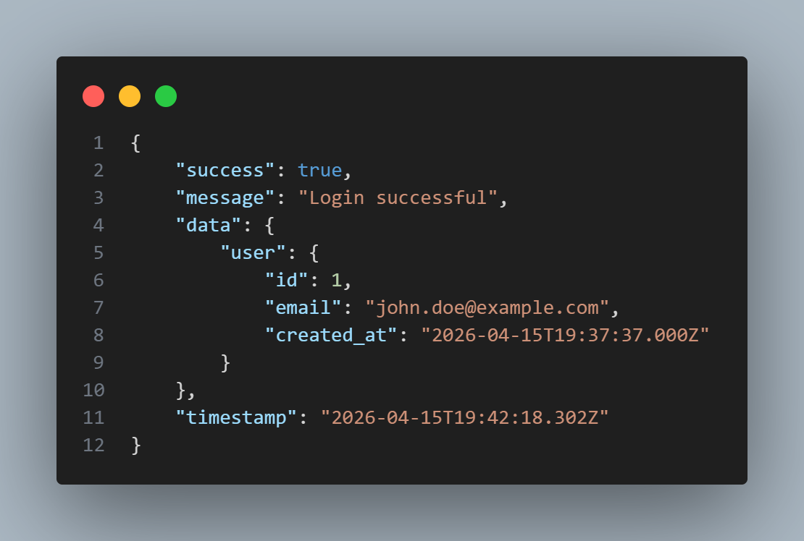
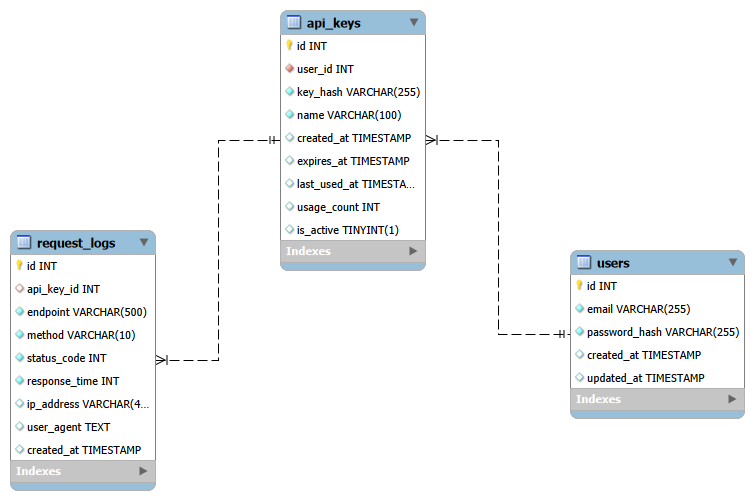

# API Gateway System 

> Developed by **Ahmed Medhat**

---
## Project Overview
**API Gateway System**: A production-inspired backend system for managing and securing API access with API key authentication, rate limiting, and request logging.

**Developed by:** Ahmed Medhat
**Project Type:** Web Application
**License:** Proprietary – All rights reserved

<div align="center">
  
</div>

---
## Project Structure

### API-GATEWAY-SYSTEM
```js
api-gateway-system/
├── database/
├── public/
├── server/
└── README.md
```

### Database (MySQL)
```js
database/
├── api_gateway_system_erd.pdf
├── api_gateway_system_erd.png
└── schema.sql
```

<div align="center">
  
</div>

### Public
```js
public/
└── api_gateway_system_erd.png
```

### Backend (Express.js)
```js
server/
├── app/
│   ├── controllers/
│   │   ├── apiKeyController.js
│   │   └── authController.js
│   ├── middlewares/
│   │   ├── authMiddleware.js
│   │   ├── loggerMiddleware.js
│   │   ├── rateLimiterMiddleware.js
│   │   └── validationMiddleware.js
│   ├── models/
│   │   ├── ApiKey.js
│   │   ├── Log.js
│   │   └── User.js
│   ├── services/
│   │   ├── apiKeyService.js
│   │   ├── loggingService.js
│   │   └── rateLimiterService.js
│   └── validations/
│       ├── apiKey.js
│       └── auth.js
├── config/
│   └── database.js
├── node_modules/
├── routes/
│   ├── apiKey.routes.js
│   └── auth.routes.js
├── tests/
│   ├── test-api-key.test.js
│   └── test-database.test.js
├── utils/
│   ├── hash.js
│   └── response.js
├── .env
├── .gitignore
├── index.js
├── package-lock.json
└── package.json
```

---
## Technologies Used

### Backend Technologies
| Technology                                                                                                                | Purpose                           | Version |
| ------------------------------------------------------------------------------------------------------------------------- | --------------------------------- | ------- |
|                 | JavaScript Runtime Environment    | 18.x+   |
|             | Web Application Framework         | 4.x     |
|                  | API Rate Limiting Middleware      | 7.x     |
|                      | Security Headers Middleware       | 7.x     |
|                            | Cross-Origin Resource Sharing     | 2.x     |
|                      | Password Hashing Library          | 5.x     |
|                    | Cookie Parsing Middleware         | 1.x     |
|                      | HTTP Request Logger               | 1.x     |
|                   | Development Server Auto-Restart   | 3.x     |
|                      | Environment Variables Loader      | 16.x    |
|                     | JSON Web Tokens Authentication    | 9.x     |
|                       | MySQL Database Driver             | 3.x     |

### Database & Tools
| Technology                                                                                                                | Purpose                           | Version |
| ------------------------------------------------------------------------------------------------------------------------- | --------------------------------- | ------- |
|                         | Relational Database               | 8.x     |
|     | Database Design & Management      | 8.x     |

---

## Installation

**Step 1. Setup Express.js Project:**
```bash
mkdir api-gateway-system
cd api-gateway-system
npm init -y
```

**Step 2: Install all dependencies:**
```bash
npm install express mysql2 bcrypt dotenv cors helmet express-rate-limit express-validator
npm install --save-dev nodemon
```

---
# API Documentation
## Base URL
```bash
http://localhost:PORT/api/
```

**Step 1:** Register a New User
```bash
Method: POST
URL: http://localhost:8080/api/auth/register
Body (raw JSON):
{
  "email": "john.doe@example.com",
  "password": "TestPassword123"
}
```

**Expected Response (201 Created):**
```json
{
    "success": true,
    "message": "User registered successfully",
    "data": {
        "user": {
            "id": 1,
            "email": "john.doe@example.com",
            "created_at": "2026-04-15T19:37:37.000Z"
        }
    },
    "timestamp": "2026-04-15T19:37:37.400Z"
}
```

**Step 2:** Login User
```bash
Method: POST
URL: http://localhost:8080/api/auth/login
Headers: 
  Content-Type: application/json
Body (raw JSON):
{
  "email": "john.doe@example.com",
  "password": "TestPassword123"
}
```

**Expected Response (200 OK):**
```json
{
    "success": true,
    "message": "Login successful",
    "data": {
        "user": {
            "id": 1,
            "email": "john.doe@example.com",
            "created_at": "2026-04-15T19:37:37.000Z"
        }
    },
    "timestamp": "2026-04-15T19:42:18.302Z"
}
```

---
# Testing Files

## Testing APIs Functionalities
```bash
npm run test:api 
```

## Testing Database Connection
```bash
npm run test:db
```

---
## License
**PROPRIETARY LICENSE**
© 2026 Ahmed Medhat. All Rights Reserved.
This project is a personal, non-commercial work created solely for the purpose of demonstrating full-stack web development skills.

*This software and associated documentation are proprietary and confidential. No part of this project may be reproduced, distributed, or transmitted in any form without prior written permission from the author.*

---
## Author
* **Ahmed Medhat** – Junior Full Stack JavaScript Developer